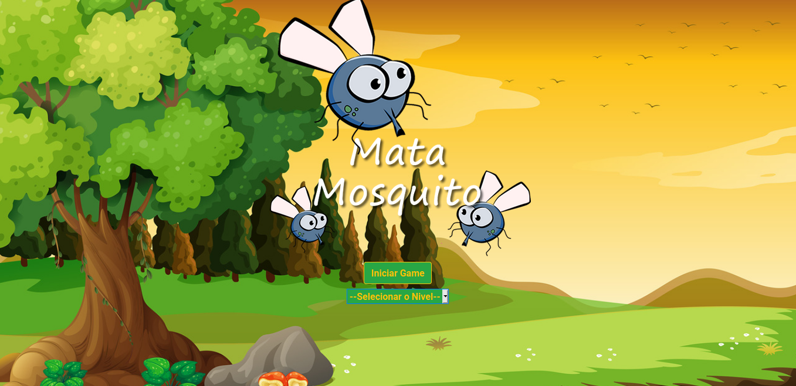

<h1 align="center">Welcome to Game Kill It 👋</h1>
<p>
  
  <a href="LICENSE" target="_blank">
    
  </a>
  <a href="https://twitter.com/andersonarorjdev" target="_blank">
    
  </a>
</p>


<h4>I know that you like games🌝 but can you win in this?🤔</h4>

>It's realy fun play simple and crazy games, when i was kid, i remember that i was playing this kind of game every day after i come from school.
> 
#### So...why don't try to do one funny too?🤔🚀

***


 ***
## This game have 4 diferent levels of dificulty, they are: 
- Easy(Recomended for kids!).😸
- Normal🥱
- Hard(You will need to open your eyes if you realy want kill some bug)😯
- Insane(Just for peoples that doesn fear death)🥶😱




## Downloading the project on your computer👇
```sh
  git clone https://github.com/andersonarorjdev/Game-Mata-Mosquito
```


## Acess "index.html" on your browser to start to play! SIMPLE, NO?👍
- This is a generical example, the location of this project will change according the folder that you saved.📢
```sh
c://user/files/Game-Mata-Mosquito/index.html
``` 

## Author

👤 **Andersonarorjdev**

* Website: https://andersonarorjdev.github.io
* Twitter: [@andersonarorjdev](https://twitter.com/andersonarorjdev)
* Github: [@andersonarorjdev](https://github.com/andersonarorjdev)
* LinkedIn: [@andersonarorjdev](https://linkedin.com/in/andersonarorjdev)

## Show your support

Give a ⭐️ if this project helped you!

## 📝 License

Copyright © 2020 [Andersonarorjdev](https://github.com/andersonarorjdev).<br />
This project is [MIT](LICENSE) licensed.


